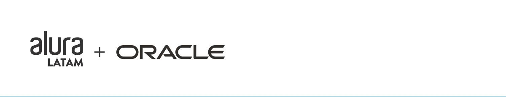
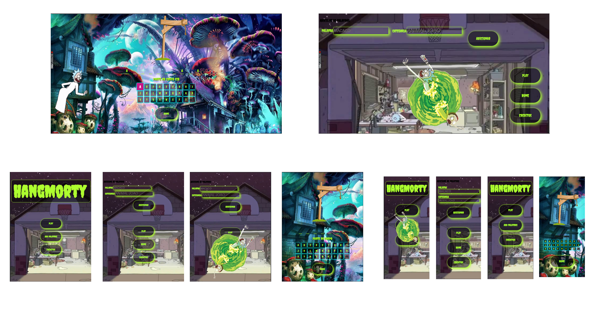

# Jogo da forca 2

# Sobre

    O segundo projeto/desafio proposto pela Alura em conjunto com ONE(Oracle Next Education).
    implementando ferramentas HTML5, CSS3, Java Script, com o objetivo de desenvolver:
    
- Requisitos:
    . Deve funcionar só com letras maiúsculas;
    . Não devem ser utilizadas letras com acentos nem caracteres especiais;
    . Ao completar o desenho da forca, deve ser exibida uma mensagem na tela de "Fim de Jogo";
    . Se completar a palavra correta antes de acabarem as tentativas, deve ser exibida na tela a mensagem "Você Venceu. Parabéns!";
    . A página deve ter os traços indicando cada letra da palavra, separados por espaço;
    . A página deve ter um botão de "Iniciar Jogo" para começar o jogo;
    . Só deve ser possívél escrever letras (os números não serão válidos)
    . As letras erradas devem aparecer na tela, mas não podem aparecer repetidamente;
    . As letras corretas devem ser mostradas na tela acima dos traços, nas posições corretas em relação à palavra.

- Extras:
A página deve conter um campo para inserção de texto com a finalidade de adicionar novas palavras ao jogo, e um botão "Adicionar nova palavra".
    

 
    Nesse projeto fiz ao meu estilo, implementei um design com base em em desenho que sou muito fã, chamado "Rick and Morty". Onde ficou super interativo e divertido, fácil e didático para o usuário utilizar. Além do desafil e extras, adicionei sons, spans interativos, responsividade.

# Caracteristicas

- [x] Elemententos HTML semântico.
- [x] CSS BEM Estilo pixelado. Responsivo Desktop, Tablet e Smartphone.  
- [x] Algoritimo em JS para funcionamento do jogo com suas condições.
- [x] Adição de palavras novas pelo usuário.
- [x] animações

# Autor
Made for Lucas Martins </> [see my linkedIn](https://www.linkedin.com/in/lucas-martins-desenvolvedor/)

# Badge 2desafio

